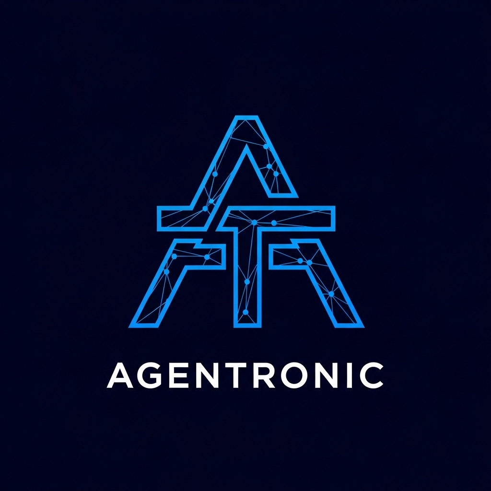
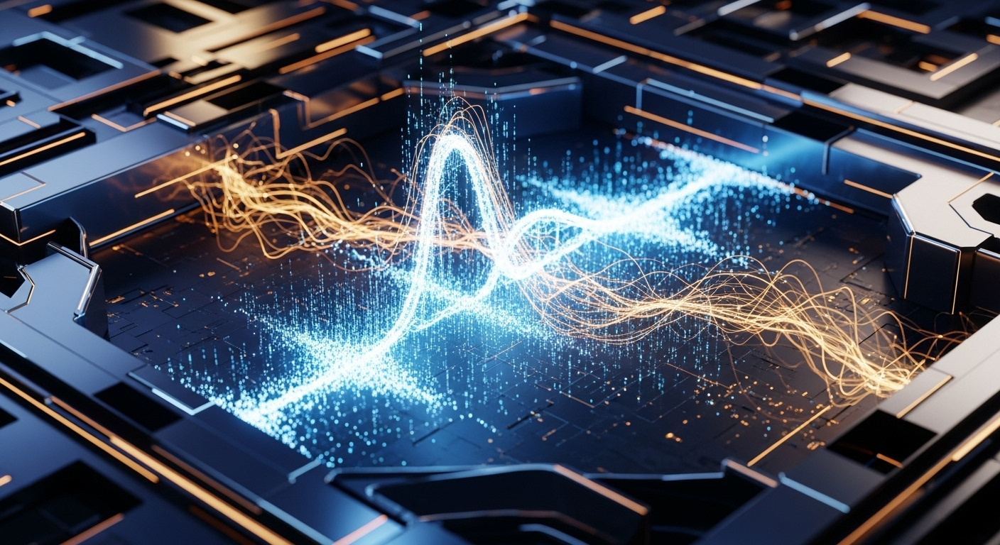
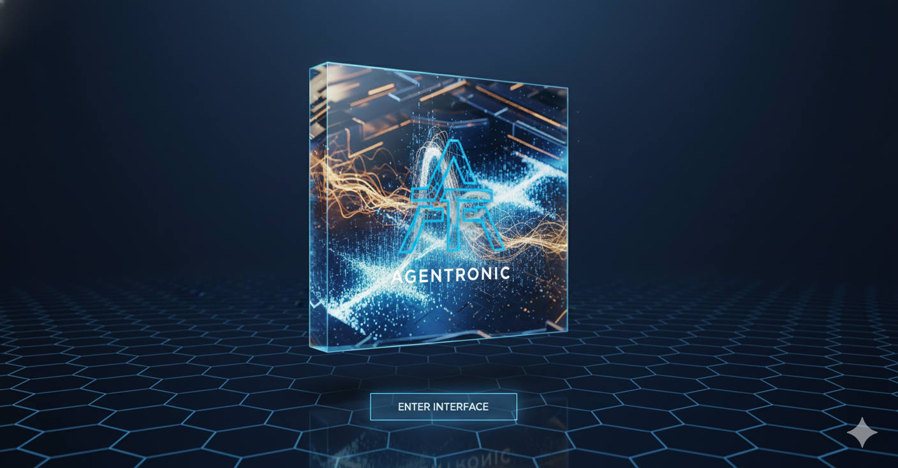

<div align="center">



# AGENTRONIC

### Semantic Music Processing System for AI Agents

[](LICENSE)
[](https://www.typescriptlang.org/)
[](https://reactjs.org/)
[](https://supabase.com/)
[](CONTRIBUTING.md)

[Live Demo](#) • [Documentation](docs/) • [API Reference](docs/api-documentation.md) • [Architecture](docs/architecture.md)

</div>

---

<div align="center">



</div>

## 🎵 Overview

AGENTRONIC is a sophisticated **4-phase architecture** enabling AI agents to understand, analyze, and generate music at a semantic level with **real-time collaboration** capabilities and **VST/Max for Live integration**.

Transform music into semantic knowledge graphs, enabling AI agents to:
- 🎼 **Understand** musical structure and harmony
- 🎹 **Analyze** melodic patterns and progressions
- 🎶 **Generate** new compositions and variations
- 🤖 **Collaborate** in real-time with other agents
- 🎚️ **Integrate** with DAWs via VST plugins

---

## ✨ Features

### 🔄 4-Phase Architecture

<table>
<tr>
<td width="50%">

#### Phase 1: Ingestion & Normalization
- **MIDI 1.0 & 2.0** parser with per-note expression
- **MusicXML** support for complex notation
- **MEI** (Music Encoding Initiative) metadata
- **OSC** (OpenSoundControl) real-time streams
- **Audio transcription** (WAV/MP3)
- Unified internal representation format

</td>
<td width="50%">

#### Phase 2: Core Semantic Model
- Temporal-harmonic **knowledge graph**
- Musical entities: Composition → Part → Measure → Note
- **Chord** and harmony relationship mapping
- Structural, temporal & harmonic connections
- High-performance graph queries

</td>
</tr>
<tr>
<td width="50%">

#### Phase 3: Analysis & Generation
- Harmonic progression analysis
- Melodic contour detection
- Formal structure identification
- Performance nuance extraction
- **AI-driven composition** & harmonization
- Orchestration and transformation services

</td>
<td width="50%">

#### Phase 4: Agent-Facing Interface
- **GraphQL API** for flexible queries
- **WebSocket** real-time communication
- **OSC bridge** for Media Control Protocol
- API key authentication & session management
- **Multi-agent collaboration** support

</td>
</tr>
</table>

### 🎛️ VST/Max for Live Integration

<div align="center">



</div>

- ⚡ Real-time MIDI streaming from Ableton Live
- 🔄 Session synchronization (tempo, time signature, transport)
- 🎚️ Bidirectional parameter automation
- 🎸 **Live jam mode** for multi-agent collaboration

### 🎨 Futuristic UI

- 🌑 Dark theme with electric **blue/cyan accents**
- ✨ Glowing effects and particle animations
- 🔷 Hexagonal grid background pattern
- 🔌 Circuit-like visual patterns
- 📱 Responsive, professional design

---

## 🚀 Quick Start

### Prerequisites

- **Node.js** 18+
- **pnpm** package manager
- **Supabase** account (for backend)

### Installation

```bash
# Clone the repository
git clone https://github.com/whodaniel/AGENTRONIC.git
cd AGENTRONIC

# Install dependencies
pnpm install

# Configure environment variables
cp .env.example .env
# Edit .env with your Supabase credentials

# Start development server
pnpm dev
```

### Environment Configuration

Create a `.env` file with your Supabase credentials:

```env
VITE_SUPABASE_URL=https://your-project.supabase.co
VITE_SUPABASE_ANON_KEY=your_supabase_anon_key_here
VITE_NODE_ENV=development
VITE_APP_URL=http://localhost:5173
```

---

## 📖 Usage

### 🎵 Upload & Analyze Music

1. Navigate to **Music Processor** section
2. Click **"SELECT FILE"**
3. Choose MIDI, MusicXML, or audio file
4. View instant analysis results

### 🤖 Agent Communication

```javascript
import { createClient } from '@supabase/supabase-js'

const supabase = createClient(
  process.env.VITE_SUPABASE_URL,
  process.env.VITE_SUPABASE_ANON_KEY
)

// Subscribe to real-time music events
const channel = supabase.channel('music-events')
channel.on('postgres_changes', {
  event: '*',
  schema: 'public',
  table: 'real_time_events'
}, (payload) => {
  console.log('Music event:', payload)
}).subscribe()
```

### 🎚️ VST Integration

1. Build VST plugin (see [`vst-integration/README.md`](vst-integration/README.md))
2. Install in Ableton Live
3. Load AGENTRONIC VST on MIDI track
4. Play notes for **real-time processing**

---

## 🏗️ Technology Stack

<table>
<tr>
<td width="33%">

### Frontend
- React 18 + TypeScript
- Tailwind CSS
- Tone.js (audio)
- Tonal.js (music theory)
- Lucide React (icons)

</td>
<td width="33%">

### Backend
- Supabase PostgreSQL
- Edge Functions (Deno)
- WebSocket real-time
- GraphQL API layer

</td>
<td width="33%">

### Music Processing
- MIDI parsing
- MusicXML/MEI parser
- Music theory engine
- Generation algorithms

</td>
</tr>
</table>

---

## 📁 Project Structure

```
AGENTRONIC/
├── .github/
│   └── assets/              # Logo and visual assets
├── src/
│   ├── components/          # React components
│   │   ├── HeroSection.tsx
│   │   ├── ArchitecturePhases.tsx
│   │   ├── MusicProcessor.tsx
│   │   ├── AgentDashboard.tsx
│   │   └── SystemStatus.tsx
│   ├── lib/
│   │   ├── musicProcessing.ts
│   │   ├── supabase.ts
│   │   └── utils.ts
│   ├── hooks/               # Custom React hooks
│   ├── App.tsx
│   └── main.tsx
├── docs/
│   ├── architecture.md      # System architecture
│   └── api-documentation.md # API reference
├── supabase/
│   └── functions/           # Edge functions
│       ├── agent-register/
│       ├── music-analyze/
│       ├── music-generate/
│       ├── music-upload/
│       └── real-time-sync/
└── vst-integration/         # VST/Max for Live code
    └── README.md
```

---

## 🏛️ System Architecture

```
┌─────────────────────────────────────────────────────────────┐
│                    AGENTRONIC SYSTEM                        │
├─────────────────────────────────────────────────────────────┤
│                                                             │
│  Phase 1: INGESTION & NORMALIZATION                         │
│  ┌────────┐ ┌────────┐ ┌────────┐ ┌────────┐              │
│  │  MIDI  │ │  XML   │ │  MEI   │ │  OSC   │              │
│  └────┬───┘ └───┬────┘ └───┬────┘ └───┬────┘              │
│       └─────────┴──────────┴──────────┘                    │
│                     │                                       │
│                     ▼                                       │
│  Phase 2: SEMANTIC KNOWLEDGE GRAPH                          │
│  ┌───────────────────────────────────────────┐             │
│  │  Compositions → Parts → Measures → Notes  │             │
│  │          Chords & Harmonic Relations      │             │
│  └───────────────────────────────────────────┘             │
│                     │                                       │
│                     ▼                                       │
│  Phase 3: ANALYSIS & GENERATION ENGINE                      │
│  ┌────────────┐ ┌────────────┐ ┌────────────┐             │
│  │  Analyze   │ │  Generate  │ │ Transform  │             │
│  └────────────┘ └────────────┘ └────────────┘             │
│                     │                                       │
│                     ▼                                       │
│  Phase 4: AGENT INTERFACE LAYER                             │
│  ┌────────────┐ ┌────────────┐ ┌────────────┐             │
│  │  GraphQL   │ │ WebSocket  │ │    OSC     │             │
│  └────────────┘ └────────────┘ └────────────┘             │
│                                                             │
└─────────────────────────────────────────────────────────────┘
```

---

## 🧪 Supabase Edge Functions

| Function | Purpose | Endpoint |
|----------|---------|----------|
| **agent-register** | Register new AI agents | `/functions/v1/agent-register` |
| **music-analyze** | Analyze musical structure | `/functions/v1/music-analyze` |
| **music-generate** | Generate new compositions | `/functions/v1/music-generate` |
| **music-upload** | Handle file uploads | `/functions/v1/music-upload` |
| **real-time-sync** | Synchronize live sessions | `/functions/v1/real-time-sync` |

---

## 📚 Documentation

- 📖 [Full API Documentation](docs/api-documentation.md)
- 🏗️ [System Architecture](docs/architecture.md)
- 🎚️ [VST Integration Guide](vst-integration/README.md)
- 🔧 [Contributing Guidelines](CONTRIBUTING.md)

---

## 🤝 Contributing

We welcome contributions! Please follow these steps:

1. Fork the repository
2. Create a feature branch: `git checkout -b feature/amazing-feature`
3. Commit your changes: `git commit -m 'Add amazing feature'`
4. Push to the branch: `git push origin feature/amazing-feature`
5. Open a Pull Request

---

## 📄 License

This project is licensed under the **MIT License** - see the [LICENSE](LICENSE) file for details.

---

## 🙏 Acknowledgments

- [Steinberg VST3 SDK](https://www.steinberg.net/vst3sdk/)
- [Cycling '74 Max/MSP](https://cycling74.com/)
- [Supabase Platform](https://supabase.com/)
- [Tone.js Library](https://tonejs.github.io/)
- Music theory and AI community

---

<div align="center">

### 🌟 Star this repo if you find it useful!

**Built with 🎵 and 🤖 by the AGENTRONIC team**

[Report Bug](https://github.com/whodaniel/AGENTRONIC/issues) • [Request Feature](https://github.com/whodaniel/AGENTRONIC/issues) • [Website](#)

</div>
